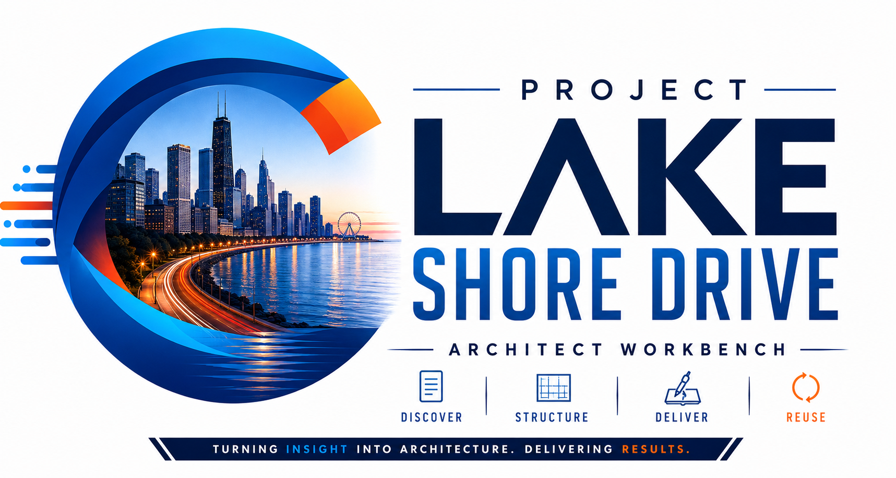
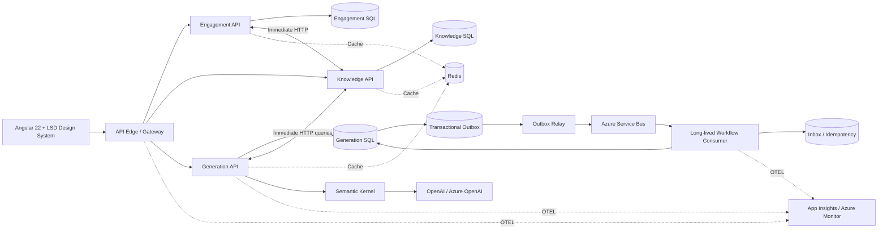

# Project Lake Shore Drive

<div>
 
</div>

Project Lake Shore Drive is an **AI Architecture Accelerator** and internal **Architect Workbench** for creating consistent consulting deliverables from reusable architecture knowledge.

The application turns structured engagement context, reusable content blocks, architecture patterns, design decisions, SCRUB prompts, and AI-assisted generation into a repeatable consulting package:

**New Engagement → Select Template → Complete Discovery → Generate → Review → Publish**

Primary outputs include:

- Proposals
- Statements of Work
- Architecture Vision documents
- Architecture assessments
- Assumptions, risks, and constraints
- Azure architecture recommendations
- Architecture Decision Records
- Estimates and delivery plans
- Project kickoff material
- Executive summaries
- Diagrams and diagram definitions
- Reusable discovery and assessment packages

> Project Lake Shore Drive is not a generic document generator. It is a governed architecture-delivery system where reusable knowledge, domain ownership, review gates, traceability, and AI-assisted drafting are first-class concerns.

## Architecture principles

### Integration rule

Project Lake Shore Drive deliberately uses **both synchronous HTTP and asynchronous messaging**.

Use **synchronous HTTP** for:

- immediate request/response interactions;
- domain queries where the caller requires the answer now;
- validation that must complete before the user can continue;
- commands that can complete within the normal request budget;
- direct service capabilities where temporal decoupling provides no business value.

Use **Azure Service Bus** for:

- cross-domain state propagation;
- long-running processing;
- document-generation workflows that may take significant time;
- fan-out or multiple independent consumers;
- retryable workflows;
- work that must survive caller disconnects;
- workflows requiring temporal decoupling;
- integration events representing facts that other bounded domains may react to.

The architecture does **not** use messaging merely because services are separate.

### Outbox and inbox rule

A service that must atomically persist durable state and publish an integration event **SHALL use a transactional outbox**.

Consumers **SHALL be idempotent**.

A consumer **SHOULD use a transactional inbox** when processing a message changes durable state and duplicate execution could create incorrect side effects.

Inbox/outbox is therefore a durability boundary for asynchronous workflows — not a requirement for ordinary synchronous HTTP integration.

## Technology baseline

| Area                    | Baseline                                                                         |
| ----------------------- | -------------------------------------------------------------------------------- |
| Backend                 | .NET 10 / ASP.NET Core                                                           |
| Local orchestration     | .NET Aspire                                                                      |
| Frontend                | Angular 22 + TypeScript                                                          |
| UI styling              | Tailwind CSS with a local Lake Shore Drive Design System                         |
| API integration         | Typed Angular API clients → gateway/API edge                                     |
| Service-to-service sync | Typed `HttpClient` integrations                                                  |
| Async messaging         | Azure Service Bus                                                                |
| Durable messaging       | Transactional Outbox / idempotent consumer / Transactional Inbox where warranted |
| Cache                   | Redis                                                                            |
| Persistence             | Microsoft SQL Server / Azure SQL, database ownership per bounded domain          |
| AI orchestration        | Semantic Kernel                                                                  |
| Model providers         | OpenAI and/or Azure OpenAI through configuration                                 |
| Observability           | OpenTelemetry + Azure Monitor / Application Insights                             |
| Secrets                 | configuration + managed identity / Key Vault in deployed environments            |

Exact hosting topology and final bounded-service catalog are architectural decisions and should be captured in ADRs rather than inferred by implementation tasks.

## Architecture at a glance



The named services above illustrate likely capability boundaries; they do not authorize creating or freezing those boundaries without an ADR.

## Service boundary rules

Each bounded domain owns:

- its API contract;
- its application/domain behavior;
- its persistence;
- its cache keys and invalidation policy;
- the integration events it publishes;
- the messages it consumes;
- its Semantic Kernel plugins/tools when those tools represent that domain's capabilities.

A service must not:

- query another service's database;
- reference another service's internal implementation project;
- share EF entities across boundaries;
- use Redis as an authoritative cross-service database;
- reach around another service's API to obtain data;
- create events that expose internal persistence models.

### Choosing HTTP vs Service Bus

Use this decision sequence:

1. **Does the caller need the result before continuing?**
   - Yes → prefer HTTP.
2. **Is the operation expected to complete within a normal HTTP request budget?**
   - Yes → HTTP is usually correct.
3. **Is the interaction primarily a query?**
   - Yes → HTTP is the default.
4. **Does the work need retryability independent of the caller, fan-out, or temporal decoupling?**
   - Yes → Service Bus.
5. **Does the work represent a long-lived workflow or asynchronous state propagation?**
   - Yes → Service Bus.
6. **Will the producer both mutate durable state and publish a message?**
   - Yes → transactional outbox.
7. **Will the consumer mutate durable state?**
   - Yes → idempotency is mandatory; transactional inbox is strongly preferred when duplicate side effects matter.

## Long-lived workflows

Long-lived workflows are explicit state machines/process managers, not chains of hidden HTTP calls.

Examples:

- generate a multi-document consulting package;
- run a long architecture assessment;
- produce multiple AI artifacts and wait for review;
- fan out diagram, proposal, estimate, and SOW generation;
- resume a failed or partially completed package;
- coordinate human approval between AI generation stages.

A long-lived workflow should expose status through an HTTP resource while internal execution proceeds asynchronously.

Recommended shape:

```text
POST /engagements/{id}/packages
        ↓
Validate request
        ↓
Persist workflow + outbox atomically
        ↓
202 Accepted + workflow/status URI
        ↓
Outbox relay → Service Bus
        ↓
Workflow consumer(s)
        ↓
Inbox/idempotency + durable state transitions
        ↓
GET /workflows/{id}
```

## AI architecture

AI-assisted creation is a governed subsystem.

### Semantic Kernel

Semantic Kernel is the orchestration layer for model calls, prompt execution, plugins/function calling, and model-provider abstraction.

Rules:

- domain code depends on Lake Shore Drive AI abstractions, not directly on provider SDKs;
- Semantic Kernel composition belongs at the AI/infrastructure boundary;
- prompts and system instructions are versioned assets;
- model names, deployments, endpoints, and credentials come from configuration;
- provider-specific configuration must not leak into domain behavior;
- plugins expose narrow, explicit functions and enforce authorization before executing;
- model output is never trusted merely because it is structured;
- generated documents carry provenance: model/deployment, prompt/template version, source knowledge references, generation timestamp, and correlation ID where appropriate.

### AI execution modes

**Interactive AI** may run synchronously when bounded, fast, cancellable, and safe for an HTTP request.

**Document/package generation** should normally be asynchronous when it:

- requires multiple model calls;
- performs retrieval or document assembly;
- can exceed the normal request duration;
- has retryable stages;
- needs human review;
- generates multiple dependent artifacts.

### Prompt and knowledge governance

Prompt templates are source-controlled and versioned.

Reusable architecture knowledge must distinguish:

- authoritative approved building blocks;
- draft content;
- engagement-specific inputs;
- generated content;
- superseded/deprecated content.

AI may draft and transform content. It must not silently promote generated material into the authoritative knowledge library.

## Angular 22 frontend

The client is an Angular 22 application.

Preferred Angular patterns:

- standalone components, directives, and pipes;
- signals for local/view state;
- `computed()` for derived state;
- `effect()` only for true side effects;
- signal-based component APIs where the codebase has adopted them;
- typed reactive forms for complex forms;
- route-level lazy loading;
- functional providers/interceptors/guards where they improve clarity;
- `OnPush` and zoneless-compatible code;
- built-in control flow (`@if`, `@for`, `@switch`);
- `@defer` for intentionally deferred UI;
- `async` pipe or deliberate observable-to-signal interop rather than manual subscription sprawl;
- strict TypeScript;
- accessible semantic HTML.

Do not introduce React conventions, JSX, React hooks, Redux, Next.js, or React-specific state-management vocabulary into the Angular client.

## Design system

The application owns a local design system under:

```text
src/web/design-system/
```

The design system is the UI source of truth for:

- primitive tokens;
- semantic color tokens;
- typography;
- spacing;
- elevation;
- radii;
- Tailwind recipes;
- reusable primitives;
- form controls;
- navigation;
- page shells;
- loading/empty/error states;
- dialogs, drawers, notifications;
- data-display patterns;
- document-generation/progress patterns.

Feature code composes design-system primitives rather than repeating large Tailwind class bundles.

## Redis

Redis is infrastructure, not a source of truth.

Appropriate uses:

- read-through/cache-aside data;
- short-lived generated previews;
- distributed coordination when explicitly designed;
- rate-limit state;
- temporary AI request/session state where loss is acceptable;
- expensive lookup caching.

Requirements:

- cache keys are namespaced by owning domain;
- TTL is explicit;
- invalidation is designed with the write path;
- code works correctly after cache eviction;
- no cross-domain contract depends on inspecting another service's cache values;
- secrets and raw sensitive prompts/documents are not cached casually.

## Reliability

### HTTP

Typed service clients should define:

- explicit timeout budgets;
- cancellation propagation;
- resilient retry only for operations safe to retry;
- no retry storms;
- correlation propagation;
- stable error contracts;
- idempotency keys for externally retried commands when appropriate.

Avoid deep synchronous call chains. If one user operation requires many sequential service calls, reconsider the boundary or move orchestration to a workflow.

### Messaging

Messages carry:

- message/event ID;
- correlation ID;
- causation ID when available;
- event type;
- schema/event version;
- occurred-at UTC;
- owning producer;
- business key where appropriate.

Duplicate delivery is normal.

Dead-letter handling is an operational workflow, not a forgotten queue.

## Observability

A single operation must be traceable across:

- Angular request;
- API edge;
- service HTTP calls;
- Redis;
- SQL;
- outbox;
- outbox relay;
- Azure Service Bus;
- inbox/consumer;
- Semantic Kernel;
- OpenAI/Azure OpenAI;
- generated artifact persistence.

Log AI metadata and performance, not secrets or unnecessarily broad prompt/document contents.

Useful AI telemetry:

- operation/generation ID;
- prompt/template version;
- model/deployment;
- token counts where available;
- latency;
- tool/plugin invocations;
- retry count;
- safety/validation result;
- human-review state;
- final workflow outcome.

## AI-assisted engineering

`CLAUDE.md` is the standing project constitution.

`.claude/` contains:

- path-specific architecture rules;
- repeatable implementation skills;
- read-only review agents;
- deterministic hooks.

The toolkit is modeled after Project Chicago's Claude Code structure, but replaces React-oriented guidance with Angular 22 and adds first-class AI, Redis, synchronous HTTP integration, and long-lived workflow guidance.

See `.claude/README.md` for the toolkit map.
