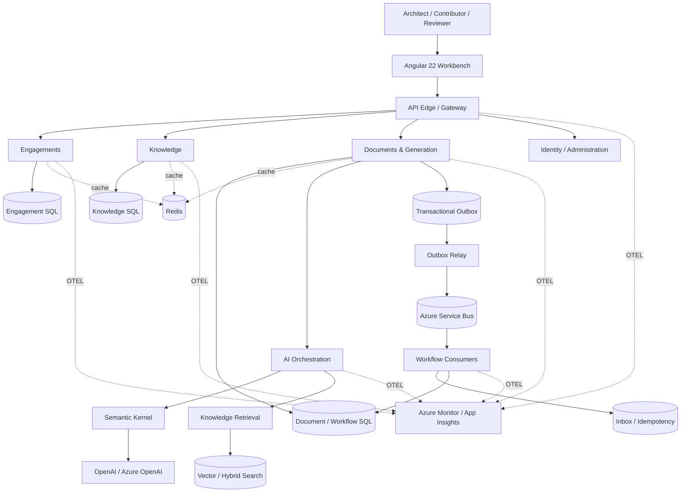
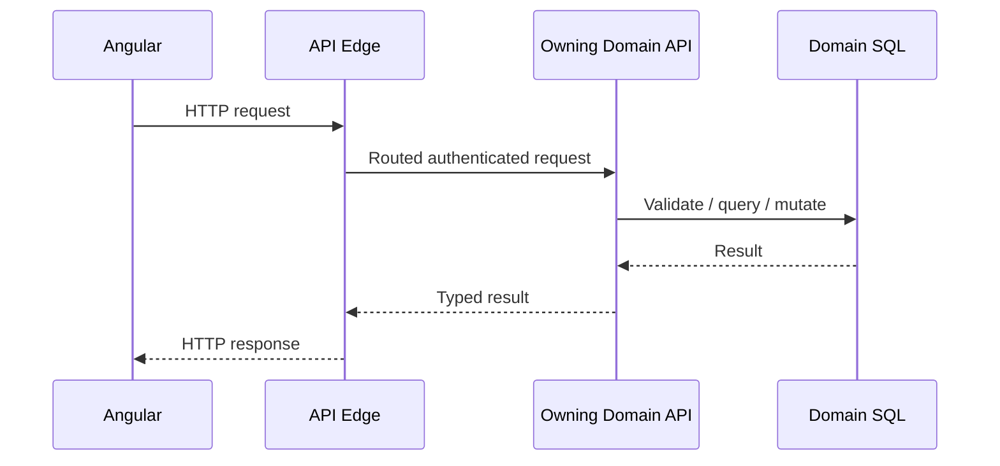
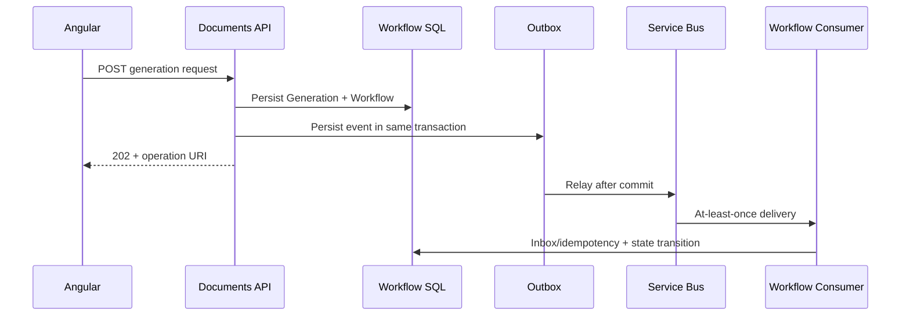

# Project Lake Shore Drive — High-Level Design

**Status:** Living target design  
**Primary sources:** Product requirements, repository README, accepted ADRs, SCRUB implementation prompts.

## 1. Purpose

Lake Shore Drive is an AI-assisted architecture workbench for conducting discovery, managing requirements and architectural decisions, estimating delivery, retrieving governed prior knowledge, composing consulting deliverables, and generating implementation bootstrap material.

## 2. Architecture drivers

| Driver | Architectural response |
|---|---|
| Structured consulting workflow | Typed domain records before generated prose |
| Human architectural authority | Explicit review/approval states |
| Traceability | Stable IDs and relationships across discovery, requirements, ADRs, RAID, estimates, documents, citations and prompts |
| AI provider isolation | Semantic Kernel plus application abstractions |
| Historical reuse | Governed RAG with metadata filters and resolvable citations |
| Long-running generation | Durable workflow state + Service Bus |
| Immediate user interactions | Synchronous HTTP |
| Reliable state propagation | Outbox → Service Bus → idempotent/inbox consumer |
| Data ownership | Database ownership per bounded domain |
| Fast repeated reads | Redis cache-aside where justified |
| UI consistency | Angular 22 + local Lake Shore Drive Design System |
| Operational diagnosis | OpenTelemetry + Application Insights/Azure Monitor |

## 3. Logical system view



The named bounded domains are a proposed logical catalog. Physical deployment boundaries may evolve by ADR.

## 4. Core bounded capabilities

### Engagements

Owns the consulting engagement source of truth: engagement metadata, discovery sessions, approved requirements, architecture selections, ADRs, findings, RAID, estimates, approvals, and traceability relationships.

### Knowledge

Owns reusable templates, architecture patterns, prompt templates, governed source artifacts, ingestion metadata, knowledge lifecycle, search/retrieval metadata, and reuse eligibility.

### Documents & Generation

Owns document definitions, sections, generation records, versions, section approval/locking, exports, long-lived generation workflows, and artifact provenance.

### Identity / Administration

Owns users, roles, application configuration, provider/model profiles, confidentiality policies, and administration capabilities.

## 5. Request path



Use HTTP for operations where the result is required now.

## 6. Durable workflow path



## 7. Internal layering

A service/module should keep transport concerns outside the business core.

```text
Controller / Function
  → Facade / Application Use Case
    → Business / Domain
      → Data / Repository
        → Owning persistence
```

AI orchestration and external provider SDKs remain infrastructure/application-boundary concerns.

## 8. Integration rule

Choose HTTP unless asynchronous behavior provides a concrete business or reliability property.

Use Service Bus when one or more are true:

- the caller must not wait;
- processing may exceed the normal request budget;
- work must survive caller disconnect;
- producer and consumer require temporal decoupling;
- retry lifecycle must be independent;
- multiple consumers may react to the same fact;
- cross-domain state propagation is eventual;
- the operation is a durable multi-step workflow.

## 9. Known architecture gates

The following should be finalized through ADRs rather than hidden implementation assumptions:

1. final bounded-service deployment catalog;
2. exact API edge/gateway technology;
3. identity/session transport;
4. vector/hybrid search implementation;
5. workflow/process-manager persistence approach;
6. artifact storage provider;
7. production Azure hosting topology;
8. infrastructure-as-code and deployment ownership;
9. model-provider profiles and data-retention policy.
